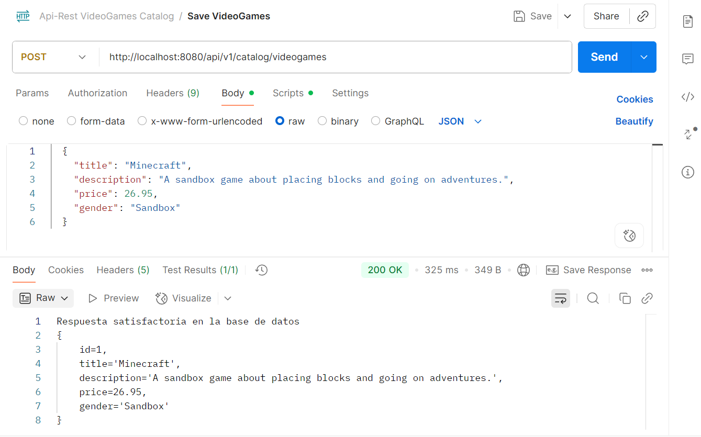
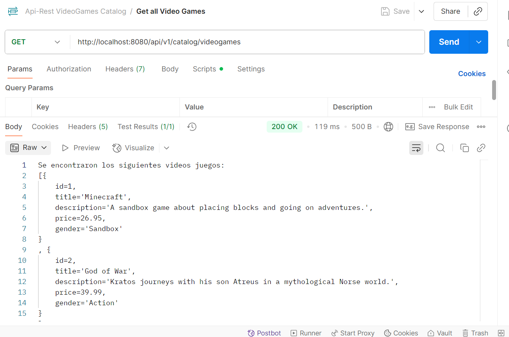
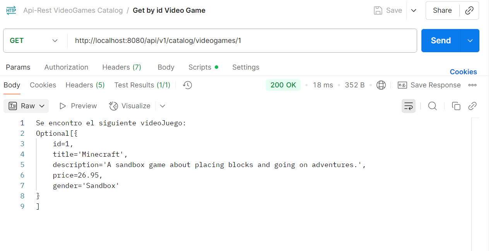
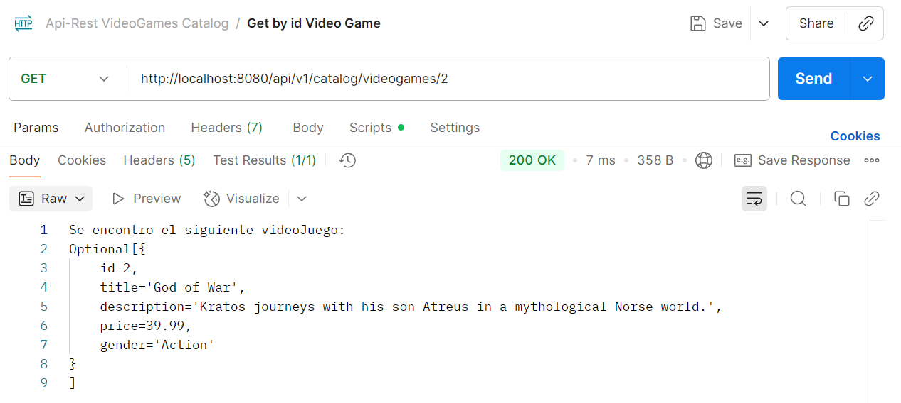
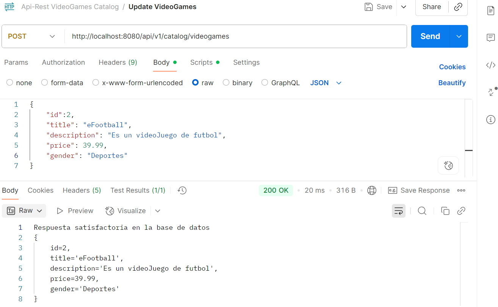
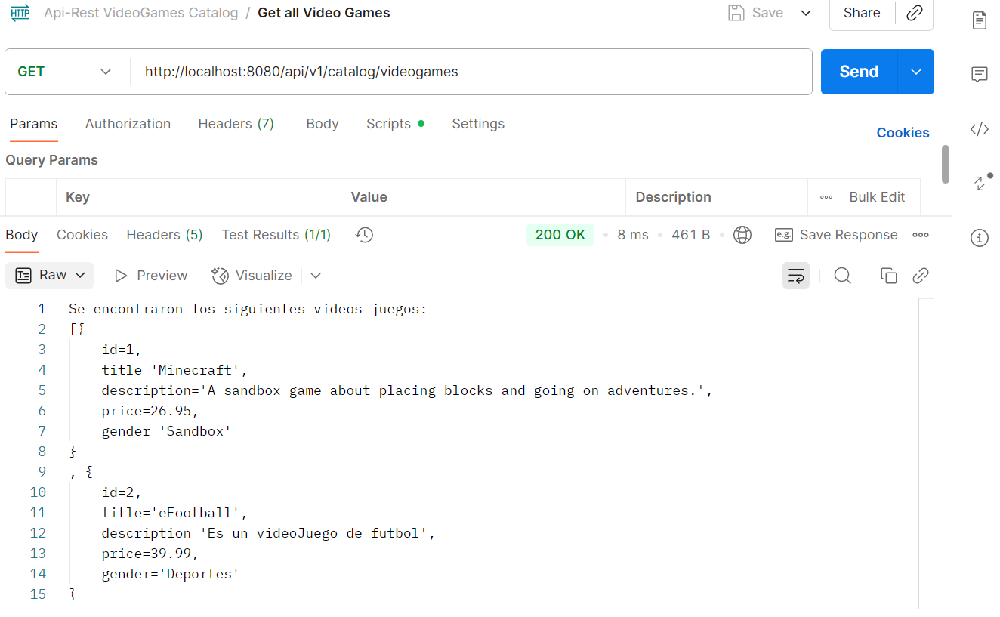
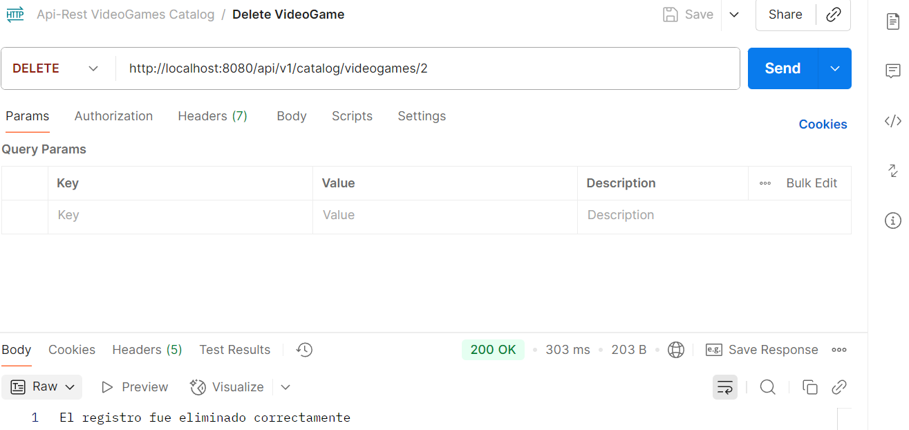
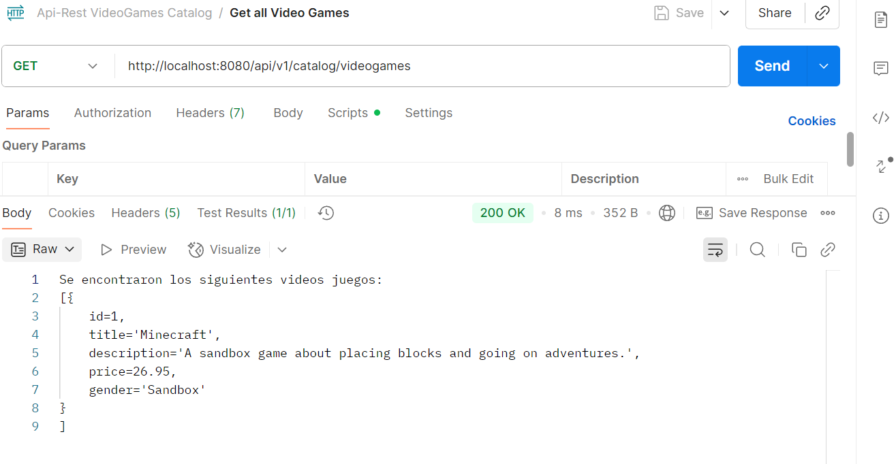

# CATALOGO VIDEO JUEGOS 
El presente proyecto es un API REST para un catalogo de video juegos, 
el cual permite almacenar, obtener, actualizar y eliminar registros de videojuegos, 
todo esto por medio de la url /api/v1/catalog/videogames

# EVIDENCIA:
* Save 

* Get All

* Get VideoGame by id

* Update VideoGame

* Delete VideoGame

